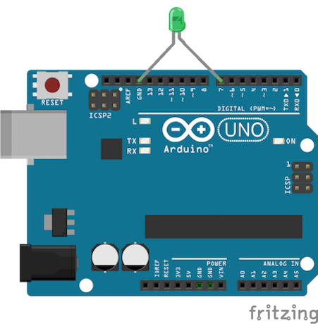

# Web Arduino
A Web Component to control an Arduino device.

## Import It in Your Project
1. Download: Run `bower install web-arduino` or `npm install web-arduino`.
2. Import: Add `<link id="webArduino" rel="import" href="path/to/web-arduino/web-arduino.html">` in your Web app.

## Examples
Blink a LED.



```html
<web-arduino id="arduino" device-name="ARDUINO"></web-arduino>
<script>
  var arduino = document.querySelector('#arduino');
  arduino.onconnected = function() {
    arduino.d7 = Arduino.HIGH;
    setInterval(function() {
      arduino.d7 = !arduino.d7;
    }, 1000);
  });
</script>
```

## Platform Compatibility
* [Firefox OS](https://developer.mozilla.org/Firefox_OS) 3.0.0.0-prerelease
